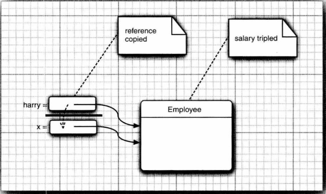

# 第3章 Java的基本程序设计结构

## 3.1 一个简单的Java应用程序

**命名规范**：
   类名为大写字母开头的名词。如果名字由多个单词组成，每个单词的一个字母都应该大写（骆驼命名法）。

**运行原理：**
   首先使用javac指令编译源代码文件（.java），并会得到一个包含这个类字节码的文件。Java编译器将字节码文件自动地命名为.class结尾的文件，并存储在源文件的同一个目录下。最后使用java指令运行程序。

## 3.2 数据类型

Java是一种强类型语言。必须为每一个变量声明一种类型。在Java中，一共有8中基本类型，其中4种整型、2种浮点类型、1种字符类型char和一种表示真值的boolean类型。

**整型**
	   整型用于表示没有小数部分的数值，允许是负数。Java提供了4种整型，如下所示：


**浮点类型**

​     浮点类型用于表示有小数部分的数值。Java种有两种浮点类型，如下所示：


因为double表示的数值精度是float类型的两倍，所以也被称为双精度数值。 默认的浮点数值为double型，只有数值后有一个后缀F或f（例如，3.14F），才会被称为float型。

**char类型**

​    char类型的字面量值要用单引号括起来。例如：'A'是编码值为65的字符常量。它与"A"不同，"A"是包含一个字符A的字符串。

**boolean类型**

   boolean（布尔）类型有两个值：false和true，用来判定逻辑条件。整数型和布尔型之间不能进行相互转换。

## 3.3 变量与常量

变量存储值，常量是值不变的变量。

**声明变量**

先指定变量的类型，然后是变量名。如：`double salary;`。变量名必须是一个以字母开头并由字母或数字构成的序列。

**变量初始化**

用赋值语句对一个声明的变量进行赋值操作，就叫做变量初始化。

> 注释：从Java 10 开始，对于局部变量，如果可以从变量的初始值推断出它的类型，就不再需要声明类型。只需要使用关键字var而无须指定类型：
>
> ```java
> var vacationDays = 12; // vacationDays is an int
> var greeting = "Hello"; // greeting is a String
> ```

**常量**

在Java种，使用关键字final来指示常量。如，`final double CM_PER_INCH = 2.54;`

关键字final表示这个变量只能被赋值一次。一旦被赋值之后，就不能够再更改了。习惯上，常量名使用全大写。

类常量可以在一个类中的多个方法中使用。使用关键字static final设置一个类常量，如，`private static final double CM_PER_INCH = 2.54;`。需要注意的是类常量的定义位于main方法的外部。

**枚举类型**

使变量的取值在一个有限的集合内。如自定义的枚举类型Size，`enum Size{SMALL, MEDIUM, LARGE, EXTRA_LARGE };`

声明这种类型的变量：

```java
Size s = Size.MEDIUM;
```

Size类型的变量只能存储这个类型声明中给定的某个枚举值，或者特殊值null，null表示这个变量没有设置任何值。

**数值类型之间的转换**

​		下图为数值类型之间的合法转换。


​		其中实线箭头表示无信息丢失的转换，虚线箭头表示可能有精度损失的转换。

​		当用一个二元运算符连接两个值时（例如n+f，n是整数，f是浮点数），先要将两个操作数转换为同一个类型，然后再进行计算。

- 如果两个操作数中有一个是double类型，另一个操作数就会转换为double类型。
- 否则，如果其中一个操作数是float类型，另一个操作数就会转换为float类型。
- 否则，如果其中一个操作数是long类型，另一个操作数将会转换为long类型。
- 否则，两个操作数都将被转换为int类型。

**强制类型转换**

​		在java中，可能损失信息的转换要通过强制类型转换（cast）来完成。强制类型转换的语法格式为在圆括号中给出想要转换的目标类型，后面紧跟待转换的变量名，例如：

```java
double x = 9.997;
int nx = (int) x;
```

这样，变量nx的值为9，因为强制类型转换通过截断小数部分将浮点值转换为整型。

## 3.6 字符串

​		从概念上讲，Java字符串就是Unicode字符序列。Java没有内置的字符串类型，而是在标准Java类库中提供了一个预定义类，叫做String。每个用双引号括起来的字符串都是String类的一个实例。

### 3.6.1 子串

​		String类的substring方法可以从一个较大的字符串提取一个字串。例如：

```java
String greeting = "Hello";
String s = greeting.substring(0,3);
```

创建一个由"Hel"组成的字符串。

​		substring方法中的范围选定为左闭右开，优点是方便计算字串的长度。

### 3.6.2 拼接

​		Java语言允许使用**+号连接**（拼接）两个字符串。

```java
String expletive = "Expletive";
String PG13 = "deleted";
String message = expletive + PG13;
```

​		上述代码将"Expletivedeleted"赋值给变量message。

​		<u>当将一个字符串与一个非字符串的值进行拼接时，后者会转换成字符串。</u>

​		静态**join方法**可以把多个字符串拼接在一起，并用一个界定符分隔。如：

```java
String all = String.join(" / ", "S", "M", "L", "XL");
   // all is the String "S / M / L / XL"
```

​		Java 11 中，新增了一个**repeat方法**：

```java
String repeted = "Java".repeat(3); 
	//repeated is "JavaJavaJava"
```

### 3.6.3 不可变字符串

​		==String类中没有提供修改字符串中某个字符的方法==。在Java中常用**substring方法**来修改字符串。如：

```java
  //greeting is "Hello"
greeting = greeting.substring(0,3) + "p!";
```

​		上面语句将greeting变量的当前值修改为"Help!"。

​		因为字符串是不可变的，所以编译器可以让<u>字符串共享</u>，这能大大提高效率。

> 在存储着各种字符串的公共存储池中，每个字符串变量指向存储池中相应的位置。如果复制一个字符串变量，原始字符串与复制的字符串共享相同的字符。

### 3.6.4 字符串相等检测

​		可以使用**equals方法**检测两个字符串是否相等。如：

```java
s.equals(t)
```

​		如果字符串s与字符串t相等，则返回true；否则，返回false。

​		**equalsIgnoreCase方法**可以检测两个字符串是否相等，而不区分大小写。

```java
"Hello".equalsIgnoreCase("hello")  // return true
```

> **不能用 == 运算符检测两个字符串是否相等**。这个运算符只能够确定两个字符串是否存放在同一个位置上。当然，如果字符串在同一个位置上，它们必然相等。但是，完全有可能将内容相同的多个字符串副本放置在不同的位置上。
>
> ```java
> String greeting = "Hello";
> if (greeting == "Hello")  ...
> 	// probably true
> if (greeting.substring(0,3) == "Hel") ...
> 	// probably false
> ```
>
> 如果虚拟机始终将相同的字符串共享，就可以使用 == 运算符检测是否相等。但实际上只有字符串字面量是共享的，而 + 或 substring 等操作得到的字符串并不共享。

### 3.6.5 空串与 Null 串

​		空串""是长度为0的字符串，是一个Java对象，有自己的串长度（0）和内容（空）。可以调用以下代码检查一个字符串是否为空：

```java
if (str.length() == 0)
// 或
if (str.equals(""))
```

​		当String变量存放一个特殊的值null，表示目前没有任何对象与该变量关联。要检查一个字符串是否为null，可以使用以下条件：

```java
if (str == null)
```

### 3.6.6 构建字符串

​		如果需要使用许多小段的字符串来构建一个字符串，可以使用**StringBudilder类**。如：

```java
// 首先，构建一个空的字符串构建器
StringBuilder builder = new StringBuilder();
// 当每次需要添加一部分内容时，就调用append方法
builder.append(ch); // appends a single character
builder.append(str); // appends a string
// 此时调用toString方法，可以得到一个String对象。
String completedString = builder.toString();
```

## 3.7 输入与输出

### 3.7.1 读取输入

​		想要通过控制台进行输入，首先需要构造一个与”标准输入流“System.in关联的Scanner对象。

```java
Scanner in = new Scanner(System.in);
// 读取一行输入
String name = in.nextLine();
// 读取一个单词（以空白符作为分隔符）
String firstName = in.next();
// 读取一个整数
int age = in.nextInt();
```

### 3.7.2 格式化输出

使用%来格式化输出，如下所示：

```java
double x = 10000.0 / 3.0;
System.out.printf("%8.2f", x);
```

将会以一个字段宽度（field width）打印x：包括8个字符，另外精度为小数点后2个字符。也就是说会打印一个前导空格和7个字符 3333.33


​		另外，还可以指定控制格式化输出外观的各种标志。例如，逗号标志可以增加分组分隔符。

```java
System.out.printf("%,.2f", 10000.0 / 3.0); // 3,333.33
```


​	还可以使用静态的**String.format方法**创建一个格式化字符串，而不打印输出：

```java
String message = String.format("Hello, %s. Next year, you'll be %d", name, age);
```

### 3.7.3 文件输入与输出

​		使用Scanner对象==读取==一个文件。

```java
Scanner in = new Scanner(Path.of("myfile.txt"), StandardCharsets.UTF_8);
```

​		如果文件名中包含反斜杠符号，要在每个反斜杠之前再加一个反斜杠进行转义："c:mydirectory\\\mydirectory\\\myfile.txt"。

​		使用PrintWriter对象写入文件。

```java
PrintWriter out = new PrintWriter("myfile.txt", StandardCharsets.UTF_8);
```

​		如果文件不存在，创建该文件。可以像输出到System.out一样使用print、println以及printf命令。

## 3.8 控制流程

### 3.8.1 块作用域

一对{}括起来的内容即为一个块作用域。<u>不能在嵌套的两个块中声明同名的变量。</u>

## 3.9 大数

​		大数是包含在java.math包中的类：BigInteger和BigDecimal。这两个类可以处理包含任意长度数字序列的数值。BigInteger类实现任意精度的整数运算，BigDecimal实现任意精度的浮点数运算。

```java
// 使用静态的valueOf方法将普通的数值转换为大数
BigInteger a = BigInteger.valueOf(100);
//使用一个带字符串参数的构造器
BigInteger reallBig = new BigInteger("22222224332412343423432141423");
```

> 不能使用算术运算符（如：+和*）处理大数，而需要使用大叔类中的add和multiply方法。
>
> ```java
> BigInteger c = a.add(b); // c = a + b
> BigInteger d = c.multiply(b.add(BigInteger.valueOf(2))); // d = c*(b + 2)
> ```

## 3.10 数组

数组存储着相同类型值的序列。

### 3.10.1 声明数组

数组是一种数据结构，用来存储同一类型值的集合。通过一个整型下标（index，或称索引）可以访问数组中的每一个值。

在**声明数组**变量时，需要指出数组类型（数据元素类型紧跟[]）和数组变量的名字。如，下面声明了整型数组a：

```java
int[] a;
```

创建数组(声明并初始化)：

```java
int[] a = new int[100]; //or var a = new int[100];
// 或
int[] smallPrimes = { 2, 3, 5, 7};
// 匿名数组可以重新初始化一个数组。
smllPrimes = new int[]{11, 13, 15};
```

==数组长度不要求是常量==：new int[n] 会创建一个长度为n的数组。并且一旦创建了数组，就不能再改变它的长度。

### 3.10.2 访问数组元素

可以使用for循环在数组中填入元素，使用`array.length`获取数组中的元素个数。

创建一个数字数组时，所有元素都初始化为0。boolean数组的元素会初始化为false。对象数组的元素则初始化为一个特殊值null，表示这些元素（还）未存放任何对象。

### 3.10.3 for each 循环

​	增强型for循环可以用来依次处理数组（或者其他元素集合）中的每个元素，而不必考虑指定的下标值。for each 循环的语句格式为：

```java
for (variable : collection) statement
```

​	collection这一集合表达式必须时一个数组或者是一个实现了Iterable接口的类对象（例如ArrayList）。例如：

```java
for (int element : a)
	System.out.println(element);
```

> 还可以使用Arrays类中的toString方法，来打印出数组中的所有值。调用Arrays.toString(a)，将返回一个包含所有数组元素的字符串，这些元素包围在中括号内，并用逗号分隔，例如，"[1, 2, 3, 4, 5]"。

### 3.10.4 数组拷贝

​	在Java中，一个数组变量通过 = 赋值给另一个数组变量（拷贝），这时，两个变量将应用同一个数组：

```java
int[] luckyNumbers = smallPrimes;
luckyNumbers[5] = 12; // now smallPrimesp[5] is also 12
```

​	下图显示了拷贝的结果。


​	如果想要将一个数组的所有值拷贝到一个新的数组中去，可以使用Arrays类的**copyOf方法**：

```java
int[] copiedLuckyNumbers = Arrays.copyOf(luckyNumbers, luckyNumbers.length);
```

​	第二个参数是新数组的长度。这个方法通常用来增加数组的大小：

```java
luckyNumbers = Arrays.copyOf(luckyNumbers, 2*luckyNumbers.length);
```

 如果数组元素是数值型，那么额外的元素将被赋值为0；如果数组元素是布尔型，则将赋值为false。相反，如果长度小于原始数组的长度，则只拷贝前面的值。

### 3.10.5 命令行参数

main方法中的String arg[] 参数表明main方法将接收一个字符串数组，也就是命令行上指定的参数。例如，如下程序：

```java
public class Message
{
public static void main(String[] args){
	if (args.length == 0 || args[0].equals( "-h"))
		System.out.print("Hello,");
	else if (args[0].equals("-g"))
		System.out.print("Goodbye," );
	// print the other command-line arguments
    for (int i = 1; i < args.length; i++)
		System.out.print(" " +args[i]);
    System.out.println("!");
	}
}

```

使用下面这种形式调用这个程序：

```java
java Message -g cruel world
```

args数组将包含以下内容：
	args[0]: "-g"
	args[1]: "cruel"
	args[2]: "world"

这个程序会显示下面这个消息：

```java
Goodbye, cruel world!
```

### 3.10.6 数组排序

可以使用Arrays类中的**sort方法**对数值型数组进行排序，这个方法使用了优化的快速排序（QuickSort)算法。

```java
int[] a = new int[10000];
. . .
Arrays.sort(a)
```

### 3.10.7 不规则数组

不规则数组，即数组的每一行有不同的长度。如：

```java
// 包含NMAX+1行的数组
int[][] odds = new int[NMAX +1][];
// 每行分配不同的长度
for(int n = 0;n<=NMAX;n++)
	odds[n] = new int[n + 1];
```

# 第4章 对象与类

## 4.1 面向对象程序设计概述

### 4.1.1 类

**类（class）**是构造对象的模板或蓝图。由类构造（construct）对象的过程称为创建类的实例（instance）。

**封装**（encapsulation，有时称为数据隐藏）是处理对象的一个重要概念。从形式上看，封装就是将数据和行为组合在一个包中，并对对象的使用者隐藏具体的实现方式。

> 对象中的数据称为**实例字段**（instance field），操作数据的过程称为**方法**（method）。作为一个类的实例，特定对象都有一组特定的实例字段值。这些值的集合就是这个对象的当前**状态**（state）。无论何时，只要在对象上调用一个方法，它的状态就有可能发生改变。

实现封装的关键在于，绝对不能让类中的方法直接访问其它类的实例字段。程序只能通过对象的方法与对象数据进行交互。封装给对象赋予了“黑盒”特征，这是提高重用性和可靠性的关键。这意味着一个类可以完全改变存储数据的方式，只要仍旧使用同样的方法操作数据，其他对象就不会知道也不用关心这个类所发生的变化。

### 4.1.2 对象

对象的三个主要特性：

- 对象的行为（behavior）——可以对对像完成哪些操作，或者可以对对象应用哪些方法？
- 对象的状态（state）——当调用那些方法时，对象会如何相应？
- 对象的标识（identity）——如何区分具有相同行为与状态的不同对象？

> **对象的行为**时用可调用的方法来定义的。此外，每个对象都保存着描述当前状况的信息。这就是**对象的状态**。对象的状态的改变必须通过调用方法实现（如果不经过方法调用就可以改变对象状态，只能说明破坏了封装性）。
>
> 但是，对象的状态并不能完全描述一个对象。每个对象都有一个唯一的标识（identity，或称身份）。

### 4.1.3 类之间的关系

在类之间，最常见的关系有：

- 依赖（"uses-a"）；
- 聚合（"has-a"）；
- 继承（"is-a"）。

**依赖**（dependence），即"uses-a"关系，是一种最明显的、最常见的关系。如果一个类的方法使用或操纵另一个类的对象，我们就说一个类依赖于另一个类。<u>应该尽可能地将相互依赖的类减至最少。</u>

**聚合**（aggregation),即"has-a"关系，类A的对象包含类B的对象。聚合有时也被称为"关联"关系。

**继承**（inheritance），即"is-a"关系，表示一个更特殊的类与一个更一般的类之间的关系。


## 4.2 使用预定义类

### 4.2.1 对象与对象变量

要想使用对象，首先必须构造对象，并指定其初始状态。然后对对象应用方法。

在Java中，要使用**构造器**（constructor，或称构造函数）构造新实例。构造器是一种特殊的方法，用来构造并初始化对象。构造器的名字应该与类名相同。

**创建一个对象**，在构造器前面加上一个new操作符，如下所示：

```java
new Date()
```

**对象与对象变量之间的区别**，==对象变量不是一个对象，它没有实际包含一个对象，它只是引用一个对象==。只<u>经过声明而没有经过初始化</u>的对象变量没有引用任何对象。此时还不能在这个变量上使用任何Date方法，否则将产生编译错误。

**初始化变量的两个方式**，一种为引用一个新构建的对象，一种为引用一个已有的对象。

```java
Date deadline;  //deadline doesn't refer to any object
// 引用一个新构建的对象
deadline = new Date();
// 引用一个已有的对象
deadline = birthday;
```

引用一个新构建的对象


引用一个已有的对象


> 在java中，任何对象变量的值都是对存储在另外一个地方的某个对象的引用。new操作符的返回值也是一个应用。如下面语句：
>
> ```java
> Date deadline = new Date();
> ```
>
> 表达式<kbd>new Date()</kbd>构造了一个Date类型的对象，它的值是对新创建对象的一个引用。这个引用存储在变量deadline中。

### 4.2.2 Java类库中的LocalDate类

不要使用构造器来构造LocalDate类的对象，应当使用**静态工厂方法**（factory method），它会代表你调用构造器。如下面表达式：

```java
LocalDate.now(); //这会创建一个新对象，表示构造这个对象时的日期。
```

### 4.2.3 更改器方法与访问器方法

改变对象的状态的方法叫做**更改器方法（mutator method）**。

只访问对象而不修改对象的方法称为**访问器方法（accessor method）**。

## 4.3 用户自定义类

### 4.3.1 Employee类

文件名必须与源文件中的**public类**的名字相匹配。在一个源文件中，只能有一个公共类，但可以有任意数目的非公共类。

编译器将为源文件中的每一个类都生成一个<kbd>.class</kbd>结尾的类文件。一般将包含main方法的类名提供给字节码解释器，以启动这个程序。

### 4.3.2 多个源文件的使用

如果每个类都存放在一个单独的源文件中，有两种方式对源程序进行编译。一种时使用**通配符调用Java编译器**：

```java
javac Employee*.java
```

这样一来，所有与通配符匹配的源文件都将被编译成类文件。

第二种方式是**编译有main方法的那个类文件**：

```java
javac EmployeeTest.java
```

虽然使用第二种方式时并没有显示地编译Employee.java。不过，当Java编译器发现EmployeeTest.java使用了Employee类时，它会查找名为Employee.class的文件。如果没有找到这个文件，就会自动地搜索Employee.java，然后，对它进行编译。<u>更重要的是：如果Employee.java版本较已有的Employee.class文件版本更新，Java编译器就会自动地重新编译这个文件。</u>

### 4.3.3 从构造器开始

在构造类的对象时，构造器会运行，从而<u>将实例字段初始化为所希望的初始状态</u>。构造器总是结合new运算符来调用。<u>不能对一个已经存在的对象调用构造器来达到重新设置实例字段的目的。</u>

关于构造器：

- 构造器与类同名。
- 每个类可以有一个以上的构造器。
- 构造器可以有0个、1个、或多个参数。
- 构造器没有返回值。
- 构造器总是伴随着new操作符一起调用。

### 4.3.4 用var声明局部变量

在Java10中，如果可以从变量的初始值推导出它们的类型，那么可以用var关键字声明局部变量，而无须指定类型。例如：

```java
Employee harry = new Employee("Harry Hacker", 50000, 1989, 10, 1);
// 也可以用如下表达式表示
var harry = new Employee("Harry Hacker", 50000, 1989, 10, 1);
```

> var关键字只能用于方法中的局部变量。参数和字段的类型必须声明。

### 4.3.5 隐式参数与显式参数

**隐式（implicit）参数**，是出现在方法名前的Employee类型的对象。（有人把隐式参数称为方法调用的目标或接收者。）

**显式（explicit）参数**，位于方法名后面括号中的数值。

> 显示参数显示地列在方法声明中，例如double byPercent。隐式参数没有处在方法声明中。
>
> 在每一个方法中，关键字this指示隐式参数，可以如下改写：
>
> ```java
> public void raiseSalary(double byPercent){
> 	double raise = this.salary*byPercent / 100;
> 	this.salary += raise;
> }
> ```

### 4.3.6 封装的优点

如何获得或设置实例字段的值：

- 一个私有的数据字段；
- 一个公共的字段访问器方法；
- 一个公共的字段更改器方法。

优点1，可以改变内部实现，而除了该类的方法之外，这不会影响其他代码。

优点2，更改器方法可以完成错误检查，而只对字段赋值的代码可能没有这个麻烦。

> 警告⚠：不要编写返回可变对象引用的访问器方法，这会破坏封装性。如果需要返回一个可变对象的引用，首先应该对它进行**克隆**（clone）。

### 4.3.7 基于类的访问权限

==一个方法可以访问所属类的所有对象的私有数据==。如下面的比较两个员工的equals方法。

```java
class Employee{
	. . .
	public boolean equals(Employee other){
		return name.equals(other.name);
    }
}
// 调用方式为
if (harr.equals(boss)) . . .
```

这个方法不仅访问了harry的私有字段，还访问了boss的私有字段。这是合法的，因为boss是Employee类型的对象，而Employee类的方法可以访问任何Employee类型对象的私有字段。

### 4.3.8 final实例字段

final实例字段必须在构造对象时初始化。也就是说，必须确保在每一个构造器执行之后（可以通过**构造函数**或在**声明时**或者**实例初始化块**中进行初始化），这个字段的值已经设置，并且以后**不能再修改这个字段**。

> 对于使用final修饰符修饰可变的类，可能会造成理解混乱。例如：
>
> ```java
> private final StringBuilder evaluations;
> // 构造器中初始化为
> evaluations = new StringBuilder();
> ```
>
> 此时final关键字只是表示存储在evaluations变量中的对象引用不会再指示另一个不同的StringBuilder对象。但是这个对象是可以更改的：
>
> ```java
> public void giveGoldStar(){
> 	valuations.append(LocalDate.now() + ": Gold star!\n");
> }
> ```
>
> 

## 4.4 静态字段与静态方法

### 4.4.1 静态字段

静态字段属于类，而不属于任何单个的对象，所有对象共享一个静态字段，即使没有实例对象，静态字段也存在。如果将一个字段定义为static，那么每个类只有一个这样的字段。而对于非静态的实例字段，每个对象都有自己的一个副本。

==静态字段==一般<u>使用类来调用</u>，格式为：类名.静态字段名。

==非静态字段==<u>使用实例对象来调用</u>。

> 在一些面向对象程序设计语言中，静态字段被称为类字段。术语”静态“只是沿用了C++的叫法，并无实际意义。

### 4.4.2 静态常量

使用关键字static final设置一个类常量，如，`private static final double CM_PER_INCH = 2.54;`。静态常量必须在**声明时**或**静态初始化块**中进行初始化，并且只能初始化一次。

### 4.4.3 静态方法

静态方法是不在对象上执行的方法，可以认为静态方法是没有this参数的方法（在一个非静态的方法中，this参数指示这个方法的隐式参数）。

静态方法不能访问实例字段，因为他不能在对象上执行操作。但是，静态方法可以访问静态字段。

在下面两种情况下可以使用静态方法：

- 方法不需要访问对象状态，因为它需要的所有参数都通过显式参数提供（例如：Math.pow）。
- 方法只需要访问类的静态字段（例如：Employee.getNextId)。

> 静态方法不能访问非静态成员（实例字段和实例方法），但是可以通过实例化类来访问非轻抬成员。
>
> 实例方法之间可以互相访问，实例方法也可以访问静态成员（静态方法和静态字段）。

### 4.4.4 工厂方法

静态方法可以进行对象的构造。类似LocalDate和NumberFormat的类使用**静态工厂方法**（factory method）来构造对象。

使用静态工厂方法而不不使用构造器构造对象的原因：

- 无法命名构造。器构造器的名字必须与类名相同。但是，如果希望有两个不同的名字，就不能使用构造器来创建实例。比如NumberFormat类想要有两个不同的名字，分别得到货币实例和百分比实例。
- 使用构造器时，无法改变所构造对象的类型。如NumberFormat类使用工厂方法创建实例实际上将返回DecimalFormat类的对象，这是NumberFormat的一个子类。

### 4.4.5 main方法

> 每一个类中可以有一个main方法，通过这个规则，我们可以将其用于对类进行单元测试。
>
> 如可以在Employee类中添加一个main方法，进行单元测试时，只需要执行(此时将只执行Employee类):
>
> ```java
> java Employee
> ```
>
> 如果Employee类是一个更大型应用程序的一部分，就可以使用下面这条语句运行程序(Employee类中main方法永远不会执行)
>
> ```java
> java Application
> ```
>

## 4.5 方法参数

**按值调用**（call by value）表示方法接收的是调用者提供的值。

**按引用调用**（call by reference）表示方法接收的是调用者提供的变量地址。

**Java程序设计语言总是采用按值调用**。也就是说方法得到的是所有参数值的一个副本。具体来讲，方法不能修改传递给他的任何参数变量的内容。

Java中有两种类型的方法参数：

- 基本数据类型（数字、布尔值）。
- 对象引用。

==当基本数据类型的值作为参数时方法不可能修改参数的值，当对象引用作为参数时方法可以修改其引用的对象的状态。==

> 其原因是因为Java是按值调用，方法复制了对象引用的一个副本，它们都指向一个对象地址，所以方法可以修改对象的状态。

下面是**基本数据类型**的值作为参数，进行的按值调用流程：


下面是**对象引用**作为参数，进行的按值调用流程：



> 以下为在Java中对方法参数能做什么和不能做什么的总结：
>
> - 方法不能修改基本数据类型的参数（即数值型或布尔型）。
> - 方法可以改变对象参数的状态。
> - 方法不能让一个对象参数引用一个新的对象。

## 4.6 对象构造

### 4.6.1 重载

**在同一个类中，拥有相同方法名称，但是不同参数列表的多个方法，被称为重载方法，这种形式被称为方法的重载（overloading）。**编译器在根据特定方法调用中所使用的值类型与各个方法首部中的参数类型进行查找匹配的过程称为**重载解析**（overloading resolution）。

> Java允许重载任何方法。方法的**签名（signature）**是由方法名和参数类型组成，它是方法的唯一标识。
>
> 返回类型不是方法签名的一部分。也就是说，不能有两个名字相同、参数类型也相同却有不同返回类型的方法。

### 4.6.2 默认字段初始化

如果在构造器中没有显式地为字段设置初值，那么就会被自动地赋为默认值：数值为0、布尔值为false、对象引用为null。

> 而方法中的局部变量必须明确地初始化，这是字段与局部变量的一个重要区别。

### 4.6.3 无参数的构造器

如果写一个类时没有编写构造器，那么就会提供一个无参构造器。这个构造器将所有的实例字段设置为默认值。

如果类中至少一个构造器，但是没有提供无参数的构造器，那么构造对象时如果不提供参数就是不合法的。

> 警告⚠：仅当类中没有任何其他构造器的时候，才会得到一个默认的无参数构造器。

### 4.6.4 显式字段初始化

有两种显示字段初始化的方法：

- 在类定义中直接为字段赋值，如：

  ```java
  private String name = "";
  ```

- 利用方法调用初始化一个字段，如：

  ```java
  private int id = assignId();
  ```

> 显式字段初始化，即在声明中为字段赋值，都是在构造器之前先完成这个赋值操作的。

### 4.6.5 调用另一个构造器

this关键字有两个用法：

1. 关键字this指示一个方法的隐式参数。如，this.字段。
2. 用在构造器中的第一个语句中，表示这个构造器将要调用同一个类的另一个构造器。如this(...)，...为另一个构造器中的参数。

### 4.6.6 初始化块

初始化数据字段的3种方式：

- 在构造器中设置值；
- 在声明中赋值；
- 在初始化块中赋值。

如下所示，在对象初始化块中初始化字段id：

```java
private static int nextId;
private int id;

// object initialization block
{
	id = nextId;
	nextId++;
}
```

> 首先运行初始化块，然后才运行构造器的主体部分。

**调用构造器时的具体处理步骤：**

1. 如果构造器的第一行调用了另一个构造器，则基于所提供的参数执行第二个构造器。
2. 否则，
   a）所有数据字段初始化为其默认值（0、false或null）。
   b）按照在类声明中出现的顺序，执行所有字段初始化方法和初始化块。
3. 执行构造器主体代码。

> 静态字段一般使用**在声明中赋值**或者**静态的初始化块**的方式来进行初始化。

## 4.7 包

使用包的主要原因是确保类名的唯一性。

### 4.7.1 类的导入

一个类可以使用所属包中的所有类，以及其他包中的公共类（public class）。

导入类的方式：

- 通过完全限定名（fully qualified name）。
- 使用import语句。在import语句中只能使用星号（*）导入一个包。

> 当导入的包中的类名发生冲突时，可以再增加一个更具体的import语句，导入其想要的类。或者再类名前加上完整的包名。
>
> 在包中定位类时编译器（compiler）的工作。类文件中的字节码总是使用完整的包名引用其他类。

### 4.7.2 静态导入

通过在import语句后加上<kbd>static</kbd>，就可以导入静态方法和静态字段。如：

```java
import static java.lang.System.*;

// 可以使用System类的静态方法和字段，而不必加类名和前缀
out.println("Goodbye, world!");  // i.e., System.out
exit(0) // i.e., System.exit
```

### 4.7.3 在包中增加类

要想将类放入某个包中，就必须使用package语句将该包的名字放在源文件的开头。如：

```java
package com.horstmann.corejava;
```

如果没有在源文件中放置package语句，那么这个源文件中的类就属于无名包（unnamed package）。无名包没有包名。

从基目录运行有包的类：

 ```java
 javac com/mycompany/PayrollApp.java
 java com.mycompany.PayrollApp
 ```

需要注意，**编译器处理文件**（带有文件分隔符和扩展名 .java的文件），而**Java解释器加载类**（带有 . 分隔符）。

> 警告⚠：编译器在编译源文件的时候不检查目录结构。例如，假定一个源文件开头有以下指令：
>
> ```java
> package com.mycompany;
> ```
>
> 即使这个源文件不在子目录com/mycompany下，并且**不依赖于其他包**，就可以通过编译而不会出现编译错误。但是，最终的程序将无法运行，除非先将所有类文件移到正确的位置上。如果包与目录不匹配，**虚拟机**就找不到类。

### 4.7.4 包访问

标记为**public**的部分可以由<u>任意类</u>使用；标记为**private**的部分只能由<u>定义它们的类使用</u>。如果**没有指定**public或private，这个部分（类、方法或变量）可以被<u>同一个包中的所有方法访问</u>。

### 4.7.6 类路径

类文件不仅可以存储在文件系统的子目录中（类的路径必须与包名匹配），还可以存储在JAR（Java归档）文件中。

> 在一个JAR文件中，可以包含多个压缩形式的类文件和子目录，这样既可以节省空间又可以改善性能。在程序中用到第三方的库文件时，通常要得到一个或多个需要包含的JAR文件。

为了使类能够被多个程序共享，需要做到如下几点：

1. 把类文件放到一个目录中，例如/home/user/classdir。
2. 将JAR文件放在一个目录中，例如：/home/user/archives。
3. 设置类路径（class path）。类路径是所有包含类文件的路径的集合。

类路径包括：

- 基目录/home/user/classdir;
- 当前目录（.);
- JAR文件/home/user/archives/archive.jar。

由于总是会搜索Java API的类，所以不必显式地包含在类路径中。

> 警告⚠：javac编译器总是在当前目录中查找文件，但java虚拟机仅在类路径中包含"."目录的时候才查看当前目录。如果没有设置类路径那么没有什么问题，因为默认的类路径会包含"."目录。但是如果你设置了类路径却忘记包含"."目录，那么尽管你的程序可以没有错误地通过编译，但不能运行。

类路径所列出的目录和归档文件时搜寻类的起始点。下面是一个类路径的示例：

```java
/home/user/classdir:.:/home/user/archives/archive.jar
```

当虚拟机要搜寻一个类文件时，它首先查看Java API类，然后才是查看类路径。

编译器查找文件比虚拟机要复杂些。如果引用了一个类，而没有确定这个类的包，那么编译器将首先查找包含这个类的包。如果源代码应用了Employee类。

首先编译器将尝试查找java.lang.Employee（因为java.lang包总是会默认导入）、源文件中包含的所有import指令和当前包中的Employee。然后它会在类路径所有位置中搜索以上各个类。如果找到一个以上的类，就会产生编译时错误（因为完全限定类名必须是唯一的，所以import语句的次序并不重要）。

> 编译器的任务不止这些，它还要查看源文件是否比类文件新。如果是这样的话，那么源文件就被自动地重新编译。
>
> 在前面已经知道，只可以导入其他包中的公共类。一个源文件只能包含一个公共类，并且文件名与公共类名必须匹配。因此，编译器很容易找到公共类的源文件。不过，还可以从当前包中导入非公共类。这些类有可能在与类名不同的源文件中定义。如果从当钱包中导入一个类，编译器就要搜索当前包中的所有源文件，查看哪个源文件定义了这个类。

## 4.8 JAR文件

Java归档（JAR）文件**设计的目的**：在将应用程序打包时，只向用户提供一个单独的文件，而不是一个包含大量类文件的目录结构。

### 4.8.1 创建JAR文件

可以使用jar工具制作JAR文件（在默认的JDK安装中，这个工具位于jdk、bin 目录下）。创建一个新JAR文件最常用的命令使用以下语法：

```java
jar cvf jarFileName file1 file2 ...
// 例如
jar cvf CalculatorClasses.jar *.class icon.gif
// 通常，jar命令的格式如下：
jar options file1 file2
```


### 4.8.2 清单文件

除了类文件、图像和其他资源外，每个JAR文件还包含一个**清单文件（manifest）**，用于描述归档文件的特殊性。

清单文件被命名为MANIFEST.MF，它位于JAR文件的一个特殊的META-INF子目录中。符合标准的最小清单文件极其简单：

Manifest-Version：1.0

复杂的清单文件可能包含更多条目。这些清单条目被分成多个节。第一节称为主节（main section）。它作用于整个JAR文件。随后的条目用来指定命名实体的属性，如单个文件、包或者URL。它们都必须以一个Name条目开始。节与节之间用空行分开。例如：


要想**编辑清单文件**，需要将希望添加到清单文件中的行放到文本文件中，然后运行：

jar cfm jarFileName manifestFileName . . .

例如，要创建一个包含清单文件的JAR文件，应该运行：

jar cfm MyArchive.jar manifest.mf com/mycompany/mypkg/*.class

要想更新一个已有的JAR文件的清单，则需要将增加的部分放置到一个文本文件中，然后执行以下命令：

jar ufm MyArchive.jar manifest-additions.mf

### 4.8.3 可执行JAR文件

可以使用jar命令中的e选项指定程序的入口点，即通常需要在调用java程序启动器是指定的类：

jar cvfe MyProgram.jar com.mycompany.mypkg.MainAppClass files to add

或者，可以在清单文件中指定程序的朱磊，包括以下形式的语句：

Main-Class：com.mycompany.mypkg.MainAppClass

不要为主类名增加扩展名 .class。

> 警告⚠：清单文件的最后一行必须以换行符结束。否则，清单文件将无法被正确读取。常见的一个错误就是创建了一个只包含Main-Class行而没有行结束符的文本文件。

无论使用哪一种方法，用户可以简单地通过下面地命令来**启动程序**：

java -jar MyProgram.jar

### 4.8.4 多版本JAR文件

多版本JAR(mutlti-release JAR)，其中可以包含面向不同Java版本的类文件。

为了保证向后兼容，额外的类文件放在META-INF/versions目录中：


要增加不同版本的类文件，可以使用 --release标志：

jar uf MyProgram.jar --release 9 Application.class

要从头构建一个多版本JAR文件，可以使用-C选项，对应每个版本要切换到一个不同的类文件目录：

jar cf MyProgram.jar -C bin/8 . --release 9 -C bin/9 Application.class

面向不同版本编译时，要使用--release标志和-d标志来指定输出目录：

javac -d bin/8 --release 8 . . .

> 多版本JAR的唯一目的是支持你的某个特定版本的程序或库能够在多个不同的JDK版本上运行。如果增加了功能或者改变了一个API，那就应当提供一个新版本的JAR。

## 4.9 文档注释

### 4.9.1 注释的插入

注释格式为`/** . . . */`，每个文档注释包含标记以及之后紧跟着的自由格式文本（free-form text）。标记以@开始，如@since或@param。

自由格式文本的第一句应该是一个概要性的句子。javadoc工具自动地将这些句子抽取出来生成概要页。

在自由格式文本中，可以使用HTML修饰符，例如，用于强调的`<em>...</em>`、用于着重强调的 `<strong>...</strong>`、用于项目符号列表的`<ul>/<li>` 以及用于包含图像的 等。要键入等宽代码，需要使用{@code ...}而不是`<code>...</code>`这样一来，就不用操心对代码中的<字符转义了。

### 4.9.2 类注释

类注释必须放在import语句之后，类定义之前。

下面是一个类注释的例子：


### 4.9.3 方法注释

每一个方法注释必须放在所描述的方法之前。除了通用标记之外，还可以使用下面的标记：

- @param variable description
  这个标记将给当前方法的“parameters”(参数)部分添加一个条目。这个描述可以占据多行，并且可以使用HTML标记。一个方法的所有 @param 标记必须放在一起。
- @return description
  这个标记将给当前方法添加“returns”(返回)部分。这个描述可以跨多行，并且可以使用HTML标记。
- @throws class description
  这个标记将添加一个注释，表示这个方法有可能抛出异常。

下面是一个方法注释的示例：


### 4.9.4 字段注释

只需要对公共字段（通常指静态常量）建立文档。例如，


### 4.9.5 包注释

要想产生包注释，需要在每一个包目录中添加一个单独的文件。可以
有如下两个选择:

1. 提供一个名为 package-info.java 的Java文件。这个文件必须包含一个初始的以`/**...*/`界定的Javadoc注释，后面是一个 package 语句。它不能包含更多的代码或注释。
2. 提供一个名为 package.htm的HTML文件。会抽取标记 `<body>...</body>`之间的所有文本。

### 4.9.6 注释抽取

假设你希望HTML文件将放在名为docDirectory的目录下。执行以下步骤：

1. 切换到包含想要生成文档的源文件的目录。如果有嵌套的包要生成文档，例如 com.horstmann.corejava，就必须切换到包含子目录 com的目录(如果提供了 overview.html文件的话，这就是这个文件所在的目录)。
2. 如果是一个包，应该运行命令:
   javadoc -d docDirectory nameOfPackage
   或者，如果要为多个包生成文档，运行:
   javadoc -d docDirectory nameOfPackage nameOfPackage2...
   如果文件在无名的包中，就应该运行:
   javadoc -d docDirectory *java
   如果省略了 -d docDirectory 选项，那HTML文件就会被提取到当前目录下。这样有可能会带来混乱，因此不提倡这种做法。

## 4.10 类设计技巧

1. 一定要保证数据私有。
2. 一定要对数据进行初始化。
3. 不要在类中使用过多的基本类型。
4. 不是所有的字段都需要单独的字段访问器和字段更改器。
5. 分解有过多职责的类。
6. 类名和方法名要能够体现它们的职责。
7. 优先使用不可变的类。

# 第5章 继承

## 5.1 类、超类和子类

### 5.1.1 定义子类

使用关键字extends表示继承。关键字extends表明正在构造的新类派生于一个已存在的类。这个已存在的类称为超类（superclass）、基类（base class)或父类（parent class）；新类称为子类（subclass）、派生类（derived class）或孩子类（child class）。

> 子类可以在其内部定义自己独有的字段和方法。不能在子类的方法中访问父类的私有字段和私有方法。如果访问父类中与子类中方法签名相同的方法，则要使用super关键字来进行访问。
>
> 只有当前类的方法可以直接访问当前类的私有字段，其子类中的方法不能直接访问父类中的字段。

### 5.1.2 覆盖方法

如果超类中的有些方法对子类不适用，可以使用一个新的方法来覆盖（override）超类中的这个方法。**覆盖时要保持函数签名一致。**

如果想要调用父类中的方法，而不是当前类的重写的方法，可以使用关键字**super**解决这个问题：

```java
super.getSalary()
```

> super与this引用不是类似的概念。这是因为super不是一个对象的引用，例如，不能将值super赋给另一个对象变量，它只是一个指示编译器调用超类方法的特殊关键字。

在子类中可以增加字段、增加方法或覆盖超类的方法，不过继承绝对不会删除任何字段或方法。

> 返回类型不是签名的一部分。不过在覆盖一个方法时，需要保证返回类型的兼容性。允许子类将覆盖方法的返回类型改为原返回类型的子类型。我们说，这两个方法有**可协变**的返回类型。

### 5.1.3 子类构造器

可以在子类构造器中的**第一条语句**使用super关键字来调用父类的构造器，来进行父类的私有字段的初始化。

如果子类的构造器没有显式地调用超类的构造器，将自动调用超类的无参构造器。如果超类没有无参数的构造器，并且在子类的构造器中又没有显式地调用超类的其他构造器，Java编译器就会报告一个错误。

> 注释：关键字this有两个含义：一是指示隐式参数的引用，二是调用该类的其他构造器。类似地，super关键字也有两个含义：一是调用超类的方法，二是调用超类的构造器。在调用构造器的时候，this和super这两个关键字紧密相关。调用构造器的语句只能作为另一个构造器的第一条语句出现。构造器参数可以传递给当前类（this）的另一个构造器，也可以传递给超类（super）的构造器。

父类类型的变量既可以引用父类类型的对象，也可以引用子类类型的对象。当该变量调用子类中重写的方法的时候，虚拟机知道该变量实际引用的对象类型，能够正确地调用相应的方法。

一个对象变量可以指示多种实际类型的现象称为**多态（polymorphism）**。在运行时能够自动地选择适当的方法，称为**动态绑定（dynamic binding）**。

### 5.1.4 继承层次

由一个公共超类派生出来的所有类的集合称为继承层次（inheritance hierarchy）。在继承层次中，从某个特定的类到其祖先的路径称为该类的继承链（inheritance chain）。


### 5.1.5 多态

有一个简单规则可以用来判断是否应该将数据设计为继承关系，这就是"is-a"规则，他指出子类的每个对象也是超类的对象。反之则不是。

"is-a"规则的另一种表述是替换原则（substitution principle），它指出程序中出现超类对象的任何地方都可以使用子类对象替换。

例如，可以将子类的对象赋给超类变量。

```java
Employee e;
e = new Employee(...); //Employee object expected
e = new Manager(...); //OK, Manager can be used as well
```

在Java程序设计语言中，对象变量是**多态的（polymorphic）**。一个Employee类型的变量既可以引用一个Employee类型的对象，也可以引用Employee类的任何一个子类的对象。

如下例子，运用了替换原则：

```java
Manager boss = new Manager(..);
Employee[] staff = new Employee[3];
staff[0] = boss;
```

在这个例子中，变量staff[0]与boss引用同一个对象。**但编译器只将staff[0]看成是一个Employee对象**。

这意味着，可以这样调用：

```java
boss.setBonus(5000); // OK
```

但是不能这样调用

```java
staff[0].setBonus(5000); //ERROR
```

这是因为staff[0]声明的类型是Employee，而setBonus不是Employee类的方法。

不过，不能将超类的引用赋给子类变量。例如，下面的赋值是非法的：

```java
Manager m = staff[i]; // ERROR
```

原因很清楚：不是所有的员工都是经理。如果赋值成功，m有可能引用了一个不是经理的Employee对象，而在后面有可能会调用`m.setBonus(...)`，这就会发生运行时错误。

> 警告⚠：在Java中，子类引用的数组可以转换成超类引用的数组，而不需要使用强制类型转换。例如，下面是一个经理数组
>
> ```java
> Manager[] managers = new Manager[10];
> 
> // 将它转换成Employee[]数组完全是合法的：
> Employee[] staff = managers; // OK
> ```
>
> 这样做肯定不会有问题，请思考一下其中的缘由。毕竟，如果managers[i]是一个Manager，它也一定是一个Employee。不过，实际上将会发生一些令人惊讶的事情。**要切记managers和staff引用的是同一个数组**。现在看一下这条语句：
>
> ```java
> staff[0] = new Employee("wyj", ...);
> ```
>
> 编译器接纳了这个赋值操作。但在这里，staff[0]与managers[0]是相同的引用，似乎我们把一个普通员工擅自归入经理行列中了。这是一种很不好的情形，当调用`managers[0].setBonus(1000)`的时候，将会试图调用一个不存在的实例字段，进而搅乱相邻存储空间的内容。
>
> 为了确保不发生这类破坏，所有数组都要牢记创建时的元素类型，并负责监督仅将类型兼容的引用存储到数组中。例如，使用`new managers[10]`创建的数组是一个经理数组。如果试图存储一个Employee类型的引用就会引发ArrayStoreException异常。

> 编译器只会通过显示类型判断该变量是什么类型的对象引用。也就是说如果一个父类类型的变量引用了一个子类类型的对象，它是不能调用子类中的父类没有的方法，因为编译时通过不了。
>
> 当父类类型的变量引用了一个子类的对象，该变量调用子类中重写的父类的方法时，虚拟机会根据该变量引用的实际对象进行动态的选择调用哪个方法。这也是上述提到的动态绑定的原理。
>
> 像上面警告中的例子，虽然巧妙地使编译器通过了编译，但是在运行时发生了异常，也就是虚拟机进行了报错。

### 5.1.6 理解方法调用

准确地理解如何在对象上应用方法调用非常重要。下面假设要调用`x.f(args)`，隐式参数x声明为类C的一个对象。下面是调用过程的详细描述：

1. **编译器查看对象的声明类型和方法名。**编译器将会一一列举C类中所有名为f的方法和其超类中所有名为f而且可访问的方法（超类的私有方法不可以访问）。至此，编译器已知道所有可能被调用的候选方法。
2. **接下来，编译器要确定方法调用中提供的参数类型。**如果在所有名为f的方法中存在一个与所提供参数类型完全匹配的方法，就选择这个方法。这个过程称为重载解析（overloading resolution）。如果编译器没有找到与参数类型匹配的方法，或者发现经过类型转换后有多个方法与之匹配，编译器就会报告一个错误。至此，编译器已经知道需要调用的方法的名字和参数类型。（还未确定要调用的具体方法，只是确定了方法名和参数类型，因为有可能存在两个签名相同的方法）
3. **如果是private方法、static方法、final方法或者构造器，那么编译器将可以准确地知道应该调用哪个方法**。这称为**静态绑定（static binding）。**如果需要在运行时使用动态绑定，那么，编译器会利用动态绑定生成一个调用f(String)的指令。（如采用静态绑定，将确定调用的方法，因为静态绑定方法是唯一的）
4. **程序运行并且采用动态绑定调用方法时，虚拟机必须调用与x所引用对象的实际类型对应的那个方法。**假设x的实际类型是D，它是C类的子类。如果D类定义了方法f(String)，就会调用这个方法；否则，将在D类的超类中寻找f(String)，以此类推。

> 除了修饰符为private、static或final的方法外都是采用动态绑定的方法。


未完待续。。。


> 警告⚠：在覆盖一个方法的时候，子类方法**不能低于**超类方法的**可见性**。


### 5.1.7 阻止继承：final类和方法

有时候，我们可能希望组织人们利用某个类定义子类。在Java中，**不允许扩展的类被称为final类**。如果在定义类的时候使用了final修饰符就表明这个类是final类。

类中的某个特定方法也可以被声明为final。子类不能覆盖被声明为final的方法（final类中的所有方法自动地成为final方法）。

> 前面曾经说过，字段也可以声明为final。对于final字段来说，构造对象之后就不允许改变它们的值了。不过，如果将一个类声明为final，**只有其中的方法自动地成为final，而不包括字段。**

声明为final的方法可以减少系统的开销，因为不用执行动态绑定的查询过程。

> 如果一个方法**没有被覆盖**而且**很短**，编译器就能对它进行优化处理，这个过程称为**内联（inlining）**。例如，内联调用`e.getName()`将被替换为字段`e.name`。这是一项很有意义的改进，CPU在处理当前指令时，分支会扰乱预取指令的策略，所以，CPU不喜欢分支。然而，如果getName在另外一个类中被覆盖，那么编译器就无法知道覆盖的代码将会做什么操作，因此也就不能对它进行内联处理了。
>
> 虚拟机中的即时编译器比传统编译器的处理能力强得多。这种编译器可以准确地知道类之间的继承关系，并能检测出是否有类确实覆盖了给定得方法。如果方法很简短、被频繁调用而且确实没有被覆盖，那么即时编译器就会将这个方法进行内联处理。如果虚拟机加载了另外一个子类，而这个子类覆盖了一个内联方法，那么优化器将取消对这个方法的内联。这个过程很慢，不过很少会发生这种情况。

### 5.1.8 强制类型转换

将一个类型强制转换成另外一个类型的过程称为**强制类型转换**。如，

```java
double x = 3.045;
int nx = (int)x; // 将表达式x的值转换成了整数类型，舍弃了小数部分。
```

进行强制类型转换的唯一原因是：要在暂时忽视对象的实际类型之后使用对象的全部功能。

在Java中，每个对象变量都有一个类型。类型描述了这个变量所引用的以及能够引用的对象类型。

将一个值存入变量时，编译器将检查你是否承诺过多。如果将一个子类的引用赋给一个超类变量，编译器时允许的。但将一个超类的引用赋给一个子类变量时，就承诺过多了。必须进行强制类型转换，这样才能够通过运行时检查。

如果试图在继承链上进行向下的强制类型转换，并且”谎报“对象包含的内容，Java运行时系统将注意到你的承诺不符，并产生一个ClassCastException异常。如果没有捕获这个异常，那么程序就会终止。因此，在进行强制类型转换之前，先查看是否能够成功地转换。为此只需要使用instanceof操作符就可以实现。

```java
Manager boss = (Manager) staff[1]; // ERROR,谎报了对象包含的内容，承诺过多

// 使用instanceof判断是否成功转换
if (staff[1] instanceof Manager){
    ...
}
```

如果这个类型转换不可能成功，编译器就不会让你完成这个转换并产生编译错误。例如：

```java
String c = (String) staff[1]; //报错，编译错误，因为String不是Employee的子类
```

综上所述：

- 只能在继承层次内进行强制类型转换。
- 在将强制类型转换成子类之前，应该使用instanceof进行检查。

实际上，通过强制类型转换来转换对象的类型通常并不是一种好的做法。只有在使用Manager中特有的方法时才需要进行强制类型转换。

> 请记住，只要没有捕获ClassCastException异常，程序就会终止执行。一般情况下，最好尽量少用强制类型转换和instanceof运算符。

### 5.1.9 抽象类

抽象类由abstract关键字标记。抽象类中不一定必须有抽象方法，但包含一个或多个抽象方法的类本身必须被声明为抽象的。除了抽象方法之外，抽象类还可以包含字段和具体方法。抽象方法不需要被实现。 抽象类不能被实例化，但可以定义一个抽象类的对象变量，这样一个变量只能引用非抽象子类的对象。

抽象方法充当着占位方法的角色，它们在子类中具体实现。扩展抽象类可以有两种选择。一种是在子类中保留抽象类中的部分或所有抽象方法仍未定义，这样就必须将子类也标记为抽象类；另一种做法是定义全部方法，这样一来，子类就不是抽象的了。

> 虽然抽象超类中的方法没有被实现，但不能省略抽象超类中的抽象方法，如果这样做，就不能在抽象超类类型的变量上调用`getDescription`方法了。因为编译器只允许调用在类中声明的方法（包括超类中的）。
>

### 5.1.10 受保护访问

使用protected字段可以将方法或者字段设置为受保护类型。**在同一个包中**，protected标记的字段或方法可以被所有类所访问。**在不同包中**，只有其子类才能访问protected标记的字段，并且子类中的方法只能访问子类自身对象的protected字段，不能访问父类（包括父类的子类）对象的这个字段。

> 当访问其它类的对象的方法或者字段时，需要先创建出该类的对象。然后使用这个对象调用该方法或者类。如果是在同一个类（或者是父类）中的方法就不需要先创建该类的对象再调用中的某一个方法。
>

下面对Java中的4个访问控制修饰符做个小结：

1. 仅对本类可见——private
2. 对外部完全可见——public
3. 对本包和所有子类可见——protected
4. 对本包可见——默认，不需要修饰符。

> 本包内可见，也可以访问其他对象的protected字段。对所有子类可见，对不同包的子类来说，只能在方法中访问本类对象的protected字段。
>

## 5.2 Object：所有类的超类

Object类是Java中所有类的始祖，在Java中每个类都扩展了Object。但是并不需要明确的将它写出来。如果没有明确地指出超类，Object就被认为是这个类的超类。

### 5.2.1 Object类型的变量

可以使用Object类型的变量引用任何类型的对象：

```java
Object obj = new Empoyee("wyj", 35000);
```

但是，Object类型的变量只能作为各种值的一个泛型容器。要想对其中的内容进行具体的操作，还需要清楚对象的原始类型，并进行强制类型转换：

```java
Employee e = (Employee) obj;
```

在Java中，只有基本类型（primitive type）不是对象，没有扩展Object类。所有的数组类型，不管是对象数组还是基本类型的数组都扩展了Object类。

### 5.2.2 equals方法

Object类中的equals方法用于检测一个对象是否等于另一个对象。Object类中实现的equals方法将确定**两个对象引用是否相等（堆地址的值）**。这对很多类来说，这已经足够了。不过，经常需要基于状态检测对象的相等性，如果两个对象有相同的状态，才认为这两个对象是相等的。

原生的Object类中的equals方法判断一个对象是否等于另一个对象时，**等价于使用==来判断**。但在一些类中都对原生的equals方法进行了改写，使其可以比较两个对象状态是否相等。比如String类中的equals方法就改写了equals方法，使其进行的是字符串内容的比较。

对于堆内存空间，每new一次就会重新开辟新的堆内存空间。

对于String类型对象的内存开辟有些特殊。如果两个String变量都是用等号赋值相同的字符串，那么它们两个共享一个推内存空间。但如果通过new操作符创建一个与用等号赋值的String变量相同的值的String类型的变量它们将不会共享一个推内存空间。

但可以使用`"abc".intern()`方法来检查字符串池中是否有字符串"abc"，如果存在，则返回该字符串的引用，否则重新创建一个推内存空间来存放该字符串，并返回该内存空间的应用。

> 使用`a.equals(b)`方法时，如果a为null或者a和b都为null则会抛出NullPointerException（因为在null上不能调用方法）。如果b为null则会返回false。如果变量中可能有null的存在，则可以使用`Objects.equals(a,b)`方法来判断两个变量是否相等。

### 5.2.3 相等测试与继承

编写完美的equals方法的建议：

1. 显式参数命名为`otherobject`，稍后需要将它强制转换成另一个名为other的变量。
2. 检测 this与otherobject 是否相等:  
   `if (this == otherObject) return true;`  
   这条语句只是一个优化。实际上，这是一种经常采用的形式。因为检查身份要比逐个比较字段开销小。
3. 检测otherobject 是否为 null，如果为 null，返回 false。这项检测是很必要的。 
   `if (otherObject == null) return false;`
4. 比较 this 与 otherobject 的类。如果 eauals 的语义可以在子类中改变，就使用 getClass 检测:  
   `if (getClass() != other0bjectgetClass()) return false;`  
   如果所有的子类都有相同的相等性语义，可以使用 instanceof 检测:  
   `if (!(otherObject instanceof ClassName)) return false;`
5. 将otherObject 强制转换为相应类类型的变量:  
   `ClassName other =(ClassName) otherObject`
6. 现在根据相等性概念的要求来比较字段。使用==比较基本类型字段，使用 Object.equals 比较对象字段。如果所有的字段都匹配，就返回 true;否则返回 false。  

   ```java
   return field1 == other.field1 
       && Objects.equals(field2，other.field2)
       && . . .;
   ```

   如果在子类中重新定义equals，就要在其中包含一个super.equals(other)调用。

> 提示：对于数组类型的字段，可以使用静态的`Arrays.equals`方法检测相应的数组元素是否相等。

> 警告⚠：在覆盖Object类中的equals方法时，需要将显示参数声明为Object类型，不能声明为其他类型。否则就会变成定义一个完全无关的方法。
>
> 为了避免发生这种错误，可以使用@Override标记要覆盖的超类方法的那些子类方法。

### 5.2.4 hashCode 方法

散列码（hash code）是由对象导出的一个整型值。散列码是没有规律的。如果x和y是两个不同的对象，`x.hashCode()`与`y.hashCode()`基本上不会相同。

由于hashCode方法定义在Object类中，因此每个对象都有一个默认的散列码，**其值由对象的存储地址得出**。

字符串得散列码是**由内容导出**的。而字符串构建器`StringBuilder()`是使用的Object类的默认hashCode方法，是从对象的存储地址得出散列码。

**如果重新定义了equals方法，就必须为用户可能插入散列表的对象重新定义hashCode方法。**

hashCode方法应该返回一个整数（也可以是负数）。

当需要组合多个散列值时，可以调用`Objects.hash`并提供所有这些参数。这个方法会对各个参数调用`Objects.hashCode`，并组合这些散列值。如：

```java
public int hashCode(){
    return Objects.hash(name, salary, hireDay);
}

// 如果name为null放回0，否则返回a.hashCode()
Objects.hashCode(name);
```

**equals与hashCode的定义必须相容**：如果`x.equals(y)`返回true，那么`x.hashCode()`就必须与`y.hashCode()`返回相同的值。例如，如果定义`Employee.equals`比较员工的ID，那么hashCode方法就需要散列ID，而不是员工的姓名或存储地址。

> 提示：如果存在数组类型的字段，那么可以使用静态的`Arrays.hashCode`方法计算一个散列码，这个散列码由数组元素的散列码组成。

### 5.2.5 toString 方法

toString方法会返回表示对象值的一个字符串。Point类的toString方法将返回下面这样的字符串：

```java
java.awt.Point[x=10,y=20]
```

绝大多数（但不是全部）的toString方法都遵循这样的格式：类的名字，随后时一对方括号括起来的字段值。

> 提示：可以不写为`x.toString()`，而写作*""+x*。这条语句将一个空串与x的字符串表示（也就是`x.toString()`）相连接。与toString不同的是，即使x是基本数据类型，这条语句照样能够执行。

**Object类定义了toString方法，可以打印对象的类名和散列码**。例如，调用

```java
System.out.println(System.out);
```

将产生以下输出：

`java.io.PrintStream@2f6684`

之所以得到这样的结果，是因为`PrintStream`类的实现者没有覆盖toString方法。

> 警告⚠：令人烦恼的是，数组继承了 Object类的 toString方法，更有甚者，数组类型将采用一种古老的格式打印。例如:  
>
> ```java
> int[] luckyNumbers ={ 2，3，5, 7，11，13};
> String s = ""+luckyNumbers;
> ```
>
> 将会生成字符串`[I1a46e30`(前缀[I表明是一个整型数组)。补救的方法是调用静态方法`Arrays.toString`。代码:  
>
> ```java
> String s = Arrays.toString(luckyNumbers);
> ```
>
> 将生成字符串"[2,3,5,7,11,13]"。
>
> 要想打印多维数组（即，数组的数组），则需要调用`Arrays.deepToString`方法。

## 5.3 泛型数组列表

虽然数组在定义时，可以接收一个变量来初始化数组的大小。但没有完全解决运行时动态更改数组的问题。一旦确定了数组的大小，就不能狠容易地改变它了。在Java中，解决这个问题最简单的方法是使用Java中的另外一个类，名为ArrayList。**ArrayList类类似于数组，但在添加或删除元素时，他能够自动地调整数组容量，而不需要为此编写任何代码。**

ArrayList是一个有类型参数（type parameter）的泛型类（generic class）。为了指定数组列表保存的元素对象的类型，需要用一对尖括号将类名括起来追加ArrayList后面，例如，`ArrayList<Employee>`。

### 5.3.1 声明数组列表

声明和构造一个保存Employee对象的数组的列表：

```java
Array<Employee> staff = new ArrayList<Employee>();

//可以省去右边的类型参数
ArrayList<Employee> staff = new ArrayList<>();
```

这称为“菱形”语法，因为空尖括号<>就像是一个菱形。可以结合new操作符使用菱形语法。编译器会检查新值要做什么。如果赋值给一个变量，或传递给某个方法，或者从某个方法返回，编译器会检查这个变量、参数或方法的泛型类型，然后将这个类型放在<>中。在这个例子中，`new ArrayList<>()`将赋值给一个类型为`ArrayList<Employee>`的变量，所以泛型类型为Employee。

> 警告⚠：如果使用var声明ArrayList，就不要使用菱形语法。以下声明：
>
> ```java
> var elements = new ArrayList<>();
> ```
>
> 会生成一个`ArrayList<Object>`。

使用add方法将元素添加到数组列表中。例如，下面展示了如何将Employee对象添加到一个数组列表中：

```java
staff.add(new Employee("Harry", . . .));
staff.add(new Employee("Tony", . . .));
```

数组列表管理着一个内部的对象引用数组。最终，这个数组的空间有可能全部用尽。这时就显现出数组列表的魅力了：如果调用add而内部数组已经满了，数组列表就会自动地创建一个更大的数组，并将所有的对象从较小的数组中拷贝到较大的数组中。

如果已经知道或能够估计出数组可能存储的元素数量，就可以在填充数组之前调用ensureCapacity方法：

`staff.ensureCapacity(100);`

这个方法调用将分配一个包含100个对象的内部数组。这一来，前100此调用不会带来开销很大的重新分配空间。

另外，还可以把初始容量传递给ArrayList构造器：

`ArrayList<Employee> staff = new ArrayList<>(100);`

> 警告⚠：如下分配数组列表：
>
> `new ArrayList<>(100) // capacity is 100`
>
> 这与分配一个新数组有所**不同**：
>
> `new Employee[100] // size is 100`
>
> 数组列表的容量与数组的大小有一个非常重要的区别。如果分配一个有100个元素的数组，数组就有100个空位置（槽）可以使用。而容量为100个元素的数组列表只是**可能**保存100个元素（实际上也可以超过100，不过要以重新分配空间为代价），但是在最初，甚至完成初始化构造之后，数组列表不包含任何元素。
>

**size方法**将放回数组列表中包含的实际元素个数。例如，

`staff.size()`  
将返回staff数组列表的当前元素个数，它等价于数组a的`a.length`。

一旦能够确认数组列表的大小将保持恒定，不再发生变化，就可以调用**trimToSize方法**。这个方法将存储块的大小调整为保存当前元素数量所需要的存储空间。垃圾回收器将回收多余的存储空间。

一旦消减了数组列表大小，添加新元素就需要话时间再次移动存储块，所以应该在确认不会再向数组列表添加任何元素时再调用trimToSize。

### 5.3.2 访问数组列表元素

当访问数组列表时，不能使用[]语法格式访问或改变数组的元素，而要使用get和set方法。例如，要设置第i个元素，可以使用：

`staff.set(i, harry);`

它等价于对数组a的元素赋值（与数组一样，下标值从0开始）：

`a[i] = harry;`

> 警告⚠：只有当数组列表的大小大于i时，才能够调用`list.set(i,x)`。例如，下面这段代码时错误的：
>
> ```java
> var list = new ArraryList<Employee>(100); // capacity 100, size 0
> List.set(0, x); // no element 0 yet
> ```
>
> **要使用add方法为数组添加新元素，而不是set方法，set方法只是用来替换数组中已经加入的元素。**

下面这个技巧可以一举两得，既可以灵活地扩展数组，又可以方便地访问数组元素。首先，创建一个数组列表，并添加所有的元素。

```java
var list = new ArrayList<X>();
while(...){
    x = . . . ;
    list.add(x);
}
```

执行完上述操作后，使用toArray方法将数组元素拷贝到一个数组中。

```java
var a = new X[list.size()];
list.toArray(a);
```

可以使用索引值，从数组列表中删除一个元素：

`Employee e = staff.remove(n);`

返回删除的这个元素的值，位于这个位置之后的所有元素都向前移动一个位置，并且数组的大小减1。

插入和删除元素的操作效率很低。对于较小的数组列表来说，不必担心这个问题。单如果存储的元素数比较多，有经常需要在中间插入、删除元素，就应该考虑使用链表了。

### 5.3.3 类型化与原始数组列表的兼容性

可以将一个类型化的数组列表传递给具有原始数组列表参数的方法，而并不需要进行任何强制类型转换。但是不能将一个原始ArrayList赋给一个类型化ArrayList，这会产生一个警告。

> 虽然可以将一个类型化的数组列表传递给具有原始数组列表参数的方法，尽管编译器没有给出任何错误信息或警告，但是这样调用并不安全。

## 5.4 对象包装器与自动装箱

有时，需要将int这样的基本类型转换为对象。所有的基本类型都有一个与之对应的类。Integer类对应基本类型int。通常，这些类称为**包装器（wrapper）**。这些包装器类有显而易见的名字：Integer、Long、Float、Double、Short、Byte、Character和Boolean（前6个类派生于公共的超类Number）。**包装器类是不可变的**，即一旦构造了包装器，就不允许更改包装在其中的值。同时，包装器类还是final，因此不能派生它们的子类。

假设要定义一个整型数组列表。遗憾的是，尖括号中的类型参数不允许是基本类型，也就是说，不允许写成`ArrayList<int>`。这里就可以用到Integer包装器类。我们可以声明一个Integer对象的数组列表。

`var list = new ArrayList<Integer>();`

> 警告⚠：由于每个值分别包装在对象中，所以`ArraList<Integer>`的效率远远低于int[]数组。因此，只有当程序员操作的方便性比执行效率更重要的时候，才会考虑对较小的集合使用这种构造。

可以自动地将基本类型数据转换为包装器类型的这种变换，我们称之为**自动装箱（autoboxing）**。例如向`ArrayList<Integer>`中添加int类型的元素的操作：

`list.add(3);`  
将自动地变换成`list.add(Integer.valueOf(3));`

> 注释：大家可能认为自动包装（autowrapping）与包装器更一致，不过“装箱”（boxing）这个词源于C#。

相反地，当将一个Integer对象赋给一个int值时，将会**自动拆箱**。也就是说，编译器将以下语句：

`int n = list.get(i);`

转换成

`int n = list.get(i).intValue();`

自动地装箱和拆箱甚至也适用于算术表达式。例如，可以将自增运算符应用于一个包装器引用：

`Integer n =3;`

`n++;`

编译器将自动地插入一条对象拆箱的指令，然后进行自增计算，最后再将结果装箱。

大多数情况下容易有一种假象，认为基本类型与它们的对象包装器是一样的。但它们有一点有很大不同：同一性。大家知道，== 运算符可以应用于包装器对象，不过检测的是对象是否有相同的内存位置，因此，下面的比较通常会失败：

`Integer a = 1000;`

`integer b = 1000;`

`if(a == b) . . .`

不过，Java实现却有可能（如果选择这么做）让它成立。如果将经常出现的值包装到相同的对象中，这种比较就可能成功。这种不确定的结果并不是我们所希望的。解决这个问题的办法是在比较两个包装器对象时调用equals方法。

> 注释：自动装箱规范要求boolean、byte、char<=127，介于-128和127之间的short和int被包装到固定的对象中。例如，如果在墙面的例子中将a和b初始化为100，那么它们的比较结果一定成功。

关于自动装箱还有几点需要说明。首先，由于包装器类引用可以为null，所以自动装箱有可能会抛出一个NullPointerException异常：

```java
Integer n = null;
System.out.println(2 * n) //throws NullPointerException
```

另外，如果在一个条件表达式中混合使用Integer和Double类型，Integer值就会拆箱，提升为double，再装箱为Double：

```java
Integer n = 1;
Double x = 2.0;
System.out.println(true ? n : x); //prints 1.0
```

最后强调以下，装箱和拆箱时编译器要做的工作，而不是虚拟机。编译器再生成类的字节码时会插入必要的方法调用。虚拟机只是执行这些字节码。

使用数值包装器通常还有一个原因。Java设计者发现，可以将某些基本方法放在包装器中，这会很方便，例如，将一个数字字符串转换成数值。

要想将字符串转换成整型，可以使用下面这条语句：

`int x = Integer.parseInt(s);`

这里与Integer对象没有任何关系，parseInt是一个静态方法。但Integer类是放置这个方法的一个好地方。

## 5.5 参数数量可变的方法

可以提供参数数量可变的方法（有时这些方法被称为“变参”（varargs）方法）。

在`System.out.printf("%d %s", n, "widgets");`这个方法调用中可以有不定数量个参数。`printf`方法时这样定义的：

```java
public class PrintStream{
    public PrintStream printf(String fmt, Object... args){
        return format(fmt, args);
    }
}
```

这里的省略号...是Java代码的一部分，它表明这个方法可以接收任意数量的对象（除fmt参数之外）。

实际上，`printf`方法接收两个参数，一个是格式字符串，另一个是Object[]数组，其中保存着所有其他参数（如果调用者提供的是整数或者其他基本类型的值，会把它们自动装箱为对象）。现在不可避免地要扫描fmt字符串，并将第i个格式说明符与args[i]的值匹配起来。

换句话说，对于`printf`的实现者来说，Object... 参数类型与Object[]完全一样。

编译器需要转换每个printf调用，将参数绑定到数组中，并在必要的时候进行自动装箱：

`System.out.printf("%d %s", new Object[]{new Integer(n), "widgets"});`

也可以定义自己的可变参数的方法，可以为参数指定任意类型，甚至是基本类型。下面是一个简单的示例：这个函数会计算若干个数值中的最大值（数值个数可变）。

```java
public static double max(double... values){
    double largest = Double>NEGATIVE_INFINITY;
    for (double v : values)
        if (v>largest) largest = v;
    return largest;
}
```

可以像下面这样调用这个方法：

`double m = max(3.1, 40.4, -5);`

编译器将`new double[]{3.1, 40.4, -5}`传递给max方法。

> 注释：允许将数组**作为最后一个参数**传递给有可变参数的方法。例如：
>
> `System.out.printf("%d %s", new Object[] {new Integer(1), "widgets"});`
>
> 因此，如果一个已有方法的最后一个参数是数组，可以把她重新定义为有可变参数的方法，而不会破坏任何已有的代码。例如，Java 5中就采用这种方式增强了`MessageFormaat.format`。如果愿意，甚至可以将main方法声明为以下形式：
>
> `public static void main(String... args)`

## 5.6 枚举类

下面是一个典型的定义类型的例子：

`public enum Size{ SMALL, MEDIUM, LARGE, EXTRA_LARGE}`

实际上，这个声明定义的类型是一个类，他刚好有4个实例，不可能构造新的对象。**Size为枚举的类型，SMALL为枚举常量**。

因此，在比较两个枚举类型的值是，并不需要调用equals，直接使用”==“就可以了。

如果需要的话，可以为枚举类型增加构造器、方法和字段。当然，构造器只是在构造枚举常量的时候调用。下面是一个示例：

```java
public enum Size{
    SMALL("S"), MEDIUM("M"), LARGE("L"), EXTRA_LARGE("XL");
    
    private String abbreviation;
    
    private Size(String abbreviation){
        this.abbreviation = abbreviation;
    }
    
    public String getAbbreviation(){
        return abbreviation;
    }
    
}
```

枚举的构造器总是私有的。可以像前例中一样省略private修饰符。如果声明一个enum构造器为public或protected，会出现语法错误。

所有的枚举类型都是`Enum`类的子类。它们继承了这个类的许多方法。其中最有用的一个是`toString`，这个方法会返回枚举常量名。例如，`Size.SMALL.toString()`将返回字符串"SMALL"。

toString的逆方法是**静态方法valueOf**。例如，以下语句：

`Size s = Enum.valueOf(Size.class, "SMALL");`

将s设置成`Size.SMALL`。

每个枚举类型都有一个静态的**value方法**，它将返回一个包含全部枚举值的数组。例如，如下调用：

`Size[] values = Size.values();`

返回包含元素`Size.SMALL`、`Size.MEDIUM`、`Size.LARGE`、和`Size.EXTRA_LARGE`的数组。

**ordinal**方法返回enum声明中枚举常量的位置，位置从0开始计数。例如：`Size.MEDIUM.ordinal()`返回1。

> 注释：Enum类有一个类型参数，不过为简单起见我们省略了这个类型参数。例如，实际上枚举类型Size扩展了`Enum<Size>`。类型参数会在**compareTo方法**中使用。

## 5.7 反射

能够分析类能力的程序称为`反射（reflective）`。反射机制的功能及其强大，反射机制可以用来：

- 在运行时分析类的能力
- 在运行时检查对象，例如，编写一个适用于所有类的`toString`方法。
- 实现泛型数组操作代码。
- 利用Method对象，这个对象很像C++中的函数指针。

## 5.7.1 Class 类

在程序运行期间，Java运行时系统始终为所有对象维护一个**运行时类型标识**。这个信息会跟踪每个对象所属的类。虚拟机利用运行时类型信息选择要执行的正确的方法。

可以使用一个特殊的Java类访问这些信息，保存这些信息的类名为Class。Object类中的`getClass()`方法将会返回一个Class类型的实例。

就像Employee对象描述一个特定员工的属性一样，Class对象会描述一个特定类属性。最常用的Class方法就是`getName`。这个方法将返回类的名字，如果类在一个包里，包的名字也作为类名的一部分返回。

还可以使用静态方法`forName`获得类名对应的Class对象。

`String className = "java.util.Random";`

`Class cl = Class.forName(className);`

如果类名保存在一个字符串中，这个字符串会在运行时变化，就可以使用这个方法。如果`className`是一个类名或接口名，这个方法可以正常执行。否则，`forName`方法将抛出一个检查型异常（checked exception）。无论何时使用这个方法，都应该提供一个异常处理器（exception handler）。

获得Class类对象的第三种方法。假设T时任意的Java类型（或void关键字），`T.class`将代表匹配的类对象。例如：

`Class cl1 = Random.class; // if import java.util.*; `

`Class cl2 = int.Class;`

`Class cl3 = Double[].class;`

请注意，一个Class对象实际上表示的是一个类型，这可能是类，也可能不是类。例如，int不是类，int.class是一个Class类型的对象。

> 注释：Class类实际上是一个泛型类。例如，`Employee.class`的类型是`Class<Employee>`。

> 警告⚠：鉴于历史原因，getName方法在应用于数组类型的时候会返回有些奇怪的名字：
>
> - `Double[].class.getName()`返回"[Ljava.lang.Double;".
> - `int[].class.getName()`返回"[I".

虚拟机为每个类型管理一个唯一的Class对象。因此，可以利用==运算符实现两个类对象的比较，父类与子类的比较将要不通过。

如果有一个Class类型的对象，可以用它构造类的实例。调用`getConstructor`方法将得到一个Constructor类型的对象，然后使用newInstance方法来构造一个实例。例如：

```java
var className = "java.util.Random"; // or any other name of a class with a no-arg constructor
Class cl = Class.forName(className);
Object obj = cl.getConstructor().newInstance();
```

如果这个类没有无参数的构造器，`getConstructor`方法会抛出一个异常。

### 5.7.2 声明异常入门

当运行时发生错误时，程序就会”抛出一个异常“。抛出异常比终止程序要灵活得多，这是因为可以提供一个处理器（handler）”捕获“这个异常并进行处理。如果没有提供处理器，程序就会终止，并在控制台上打印一个消息，给出异常得类型。

异常有两种类型：**非检查型（unchecked）**异常和**检查型（checked）**异常。对于检查型异常，编译器将会检查你（程序员）是否知道这个异常并做好准备来处理后果。对于非检查型异常，编译器并不期望你为这些异常提供处理器。例如，越界错误或者访问null引用，都属于非检查型异常。

如果一个方法包含一条可能抛出检查型异常得语句，则在方法名上增加一个throws子句。

```java
public static void doSomethingWithClass(String name)
	throws ReflectiveOperationException{
    Class cl = Class.forName(name);  // might throw exception
    // do something with cl
}
```

调用这个方法的任何方法也都需要一个throws声明。这也包括main方法。如果一个异常确实出现，main方法将终止并踢狗一个堆栈轨迹。

只需要为检查型异常踢狗一个throws子句。很容易找出哪些方法会抛出检查型异常——只要你调用了一个可能抛出检查型异常的方法而没有提供相应的异常处理器，编译器就会报错。

### 5.7.3 资源

类通常由一些关联的数据文件，例如：

- 图像和声音文件。
- 包含消息字符串和按钮标签的文本文件。

在Java中，这些关联的文件被称为**资源（resource）**。

Class类提供了一个很有用的服务可以查找资源文件。下面给出必要的步骤：

1. 获得拥有资源的类的Class对象，例如，`ResourceTest.class`。
2. 有些方法，如ImageIcon类的`getImage`方法，接收描述资源位置的URL。则要调用  
   `URL url = cl.getResource("about.gif");`
3. 否则，使用`getResourceAsStream`方法得到一个输入流来读取文件中的数据。

**这里的重点在于Java虚拟机知道如何查找一个类，所以他能搜索相同位置上的关联资源。**例如，假设类ResourceTest在一个resources包中。ResourceTest.class文件就位于resources目录中，可以把一个图标文件放在同一个目录下。

除了可以将资源文件与类文件放在同一个目录中，还可以提供一个相对或绝对路径。

文件的自动装载是利用资源加载特性完成的。没有标准的方法来解释资源文件的内容。每个程序必须由自己的方法来解释它的资源文件。

### 5.7.4 利用反射分析类的能力

在`java.lang.reflect`包中有三个类**Field**、**Method**和**Constructor**分别用于描述类的字段、方法和构造器。这三个类都有一个叫做`getName`的方法，用来返回字段、方法或构造器的名称。Field类有一个`getType`方法，是用来返回描述字段类型的一个对象，这个对象的类型同样是Class。Method和Constructor类有报告参数类型的方法，Method类还有一个报告返回类型的方法。这三个类都有一个名为`getModifiers`的方法，它将返回一个整数，用不同的0/1位描述所使用的修饰符，如public和static。另外，还可以利用`java.lang.reflect`包中Modifier类的静态方法分析`getModifiers`返回的这个整数。例如，可以使用Modifier类中的`isPublic`、`isPrivate`或`isFinal`判断方法或构造器是public、private还是final。我们需要做的就是在`getModifiers`返回的整数上调用Modifier类中适当的方法，另外，还可以利用`Modifier.toString`方法将修饰符打印出来。

Class类中的`getFields`、`getMethods`和`getConstructors`方法将分别返回这个类支持的公共字段、方法和构造器的数组，其中包括超类的公共成员。Class类的`getDeclareFields`、`getDeclareMethods`和`getDeclaredConstructors`方法将分别返回类中声明的全部字段、方法和构造器的数组，其中包括私有成员、包成员和受保护成员，但不包括超类的成员。

### 5.7.5 使用反射在运行时分析对象

如何查看任意对象数据字段的名字和类型：

- 获得对应的Class对象。
- 在这个Class对象上调用getDeclaredFields。

接下来将进一步查看字段的具体内容。当然，在编写程序时，如果知道想要查看的字段名和类型，查看对象中指定字段的内容是一件很容易的事情。而利用反射机制可以查看在编译时还不知道的对象字段。

要做到这一点，关键方法时Field类中的get方法。如果f是一个Field类型的对象（例如，通过`getDeclaredFields`得到的对象），obj是某个包含f字段的类的对象，`f.get(obj)`将返回一个对象，其值为obj的当前字段值。

当然，不仅可以获得值，也可以设置值。调用`f.set(obj, value)`将把对象obj的f表示的字段设置为新值。

如果读写的是一个私有字段，那么get和set方法会抛出一个`IllegalAccessException`。只能对可以访问的字段使用get和set方法。**Java安全机制**允许查看一个对象有哪些字段，但是除非拥有访问权限，否则不允许读写那些字段的值。

反射机制的默认行为受限于Java访问机制。不过，可以调用Field、Method或Constructor对象的`setAccessible`方法覆盖Java的访问机制。例如，

`f.setAccessible(true); // now ok to call f.get(harry)`

`setAccessible`方法是`AccessibleObject`类中的一个方法，它是Field、Method和Constructor类的公共超类。这个特性是为调试、持久存储和类似机制提供的。

如果不允许访问，`setAccessible`调用会抛出一个异常。访问可以被模块系统或安全管理器拒绝。安全管理器并不常用。不过，在Java 9 中，由于Java API是模块化的，每个程序都包含模块。由于太多的库都使用了反射，所以当你使用反射访问一个模块中的非公共特性时，Java 9 和 Java 10 只会给出一个警告。

### 5.7.6 使用反射编写泛型数组代码

`java.lang.reflect`包中的Array类允许动态地创建数组。例如，Array类中的`copyOf`方法实现就使用了这个类。这个方法可以用于扩展一个已经填满的数组。

```java
Employee[] a = new Employee[100];
. . .
// array is full
a = Arrays.copyOf(a, 2*a.length);
```

我们可以利用反射来实现这个方法。我们意识到，对象数组不能强制转换成员工数组（Employee[]）。如果这样做，Java虚拟机会在运行时，生成一个`ClassCastException`异常。这里的关键是，前面已经看到，Java数组会记住每个元素的类型，即创建数组时new表达式中使用的元素类型。将一个Employee[]临时转换成Object[]数组，然后再把它转换回来是可以的，但一个从开始就是Object[]的数组却永远不能转换成Employee[]数组。为了编写这类通用的数组代码，需要能够创建与原数组类型相同的新数组。为此，需要`java.lang.reflect`包中Array类的一些方法。其中最关键的是Array类的静态方法`newInstance`，这个方法能够构造一个新数组。在调用这个方法时必须提供两个参数，一个时数组的元素类型，一个是数组的长度。

`Object newArray = Array.newInstance(componentType, newLength);`

要获得新数组的元素类型，需要完成以下工作：

1. 首先获得a数组的类对象。
2. 确认它确实是一个数组。
3. 使用Class类的`getComponentType`方法（只为表示数组的类对象定义了这个方法）确定数组的正确类型。

下面给出这段代码：

```java
public static Object goodCopyOf(Object a, int newLength){
    Class cl = a.getClass();
    if (!cl.isArray()) return null;
    Class componentType = cl.getComponentType();
    int length = Array.getLength(a);
    Object newArray = Array.newInstance(componentType, newLength);
    System.arraycopy(a, 0, newArray, 0, Math.min(length, newLength));
    return newArray;
}
```

为了能够实现上述操作，应该将`goodCopyOf`的参数声明为Object类型，而不要声明为对象型数组（Object[]）。整型数组类型int[]可以转换成Object，但不能转换成对象数组！

### 5.7.7 调用任意方法和构造器

反射机制允许你调用任意的方法。我们可以用File类的get方法查看一个对象的字段。与之类似，Method类有一个invoke方法，允许你调用包装在当前Method对象中的方法。invoke方法的签名是：

`Object invoke(Object obj, Object... args)`

第一个参数是隐式参数，其余的对象提供了显式参数。对于静态方法，第一个参数可以忽略，即可以将它设置为null。

如果返回类型是基本类型，invoke方法会返回其包装器类型。例如，假设m2表示Employee类的`getSalary`方法，那么返回的对象实际上是一个Double，必须相应地完成强制类型转换。可以使用自动拆箱将它转换为一个double：

`double s = (Double) m2.invoke(harry);`

可以通过调用`getDeclareMethods`方法，然后搜索返回地Method对象数组，得到想要地方法。也可以通过调用Class类地`getMethod`方法得到想要的方法。不同于字段的获取，在方法中有很多同名的方法，因此要准确的得到我们想要的方法，还必须提供该方法的参数类型。`getMethod`的签名是：

`Method getMethod(String name, Class... parameterType)`

例如，下面说明了如何获得Employee类的`getName`方法和`raiseSlary`方法的方法指针。

```java
Method m1 = Employee.class.getMethod("getName");
Method m2 = Employee.class.getMethod("raiseSalary", double.class);
```

可以使用类似的方法调用任意的构造器。将构造器的参数类型提供给`Class.getConstructor`方法，并把参数值提供给`Constructor.newInstance`方法：

```java
Class cl =Random.class;  //or any class with a constructor that 
						// accepts a long parameter
Constructor cons = cl.getConstructor(long.class);
Object obj = cons.newInstance(42L);
```

> **使用invoke方法的缺点**。invoke的参数和返回值必须是Object类型。这意味着必须来回进行多次强制类型转换。这样一来，编译器会丧失检查代码的机会，以至于等到测试阶段才会发现错误，而这个时候查找和修正错误会麻烦得多。不仅如此，使用反射获得方法指针的代码要比直接调用方法的代码慢得多。
>
> 有鉴于此，建议仅在绝对必要的时候才在程序中使用Method对象。通常更好得做法是使用接口以及Java 8引入的lambda表达式。特别强调：建议Java开发者不要使用回调函数的Method对象。可以使用回调的接口，这样不仅代码的执行速度更快，也更易于维护。

## 5.8 继承的设计技巧

1. 将公共操作和字段放在超类中。
2. 不要使用受保护的字段
3. 使用继承实现"is-a"关系。
4. 除非所有继承的方法都有意义，否则不要使用继承。
5. 在覆盖方法时，不要改变预期的行为。
6. 使用多态，而不要使用类型信息。
7. 不要滥用反射。
